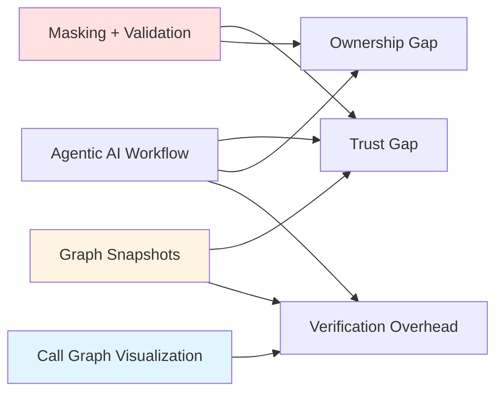
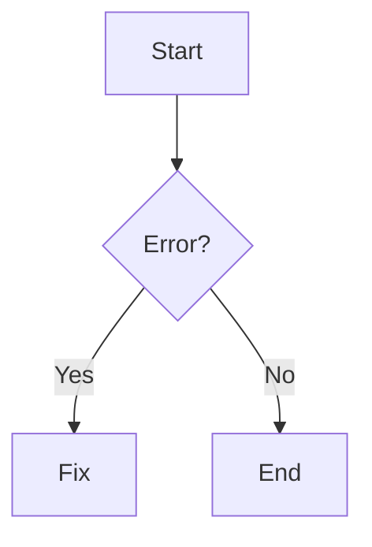

# Build-With-Me: System Vision

## Problem Statement

Agent-mode AI pair programming is increasingly embedded into IDE workflows, where an assistant can identify relevant files, propose multi-file code changes, suggest terminal commands, and iterate until a task is complete. While this increases capability, developers still face a **trust-and-ownership gap** when adopting AI-generated changes in real codebases. This is particularly apparent in mature repositories, where small inconsistencies with project conventions or architecture can create hidden integration issues and increase review effort.

As developers remain ultimately accountable for their final software, there is a need for a workflow that preserves the productivity benefits of agentic assistance while increasing developer control and reducing verification overhead.

### Core Research Question

> **How can we augment an agentic AI pair-programming workflow to preserve productivity gains while improving developer control and confidence over AI-assisted code changes?**

---

## Proposed Solution

**Build-With-Me** is a VS Code extension that builds on GitHub Copilot's agentic workflow and adds three features designed to bridge the trust-and-ownership gap:

| Feature | Purpose | Addresses |
|---------|---------|-----------|
| **Masking + Validation** | Constrain AI output and increase developer ownership | Trust gap |
| **Method-Call Visualization** | Improve structural understanding of the codebase | Verification overhead |
| **Graph Snapshots** | Control AI's task scope with explicit context | Control gap |



---

## The Three Core Features

### Feature 1: Masking + Validation

**Problem it solves:** Developers copy-paste AI-generated code without fully understanding it, leading to reduced ownership and potential hidden issues.

**How it works:**

1. **Masking:** AI-generated code is analyzed for "decision points" (conditionals, returns, error handling, key logic) using tree-sitter AST parsing
2. **Mask Insertion:** Decision points are replaced with mask markers containing hints
3. **Developer Fills:** Developer must write the actual logic, forcing engagement with the code
4. **Validation:** Parse-only validation validates the filled code

```java
// AI generates:
public void deleteUser(String id) {
    if (id == null || id.isEmpty()) {
        throw new ValidationException("Invalid user ID");
    }
    userRepository.delete(id);
}

// Developer receives (masked):
public void deleteUser(String id) {
    if /* [MASK:id=1 hint="validate input"] */ {
        throw new ValidationException("Invalid user ID");
    }
    userRepository.delete(id);
}
```

**Validation Pipeline:**

| Stage | Type | What It Checks |
|-------|------|----------------|
| Parse | Blocking | Syntax validity (tree-sitter) |

**Why it bridges the gap:**
- **Increases ownership:** Developer writes critical logic, not just accepts it
- **Builds understanding:** Forces engagement with decision points
- **Catches mismatches:** Validation ensures code follows project patterns
- **Reduces blind trust:** Developer must demonstrate understanding before code is accepted

---

### Feature 2: Method-Call Visualization

**Problem it solves:** Developers struggle to verify AI-generated code's integration with existing architecture, increasing review effort.

**How it works:**

1. **Indexing:** Backend parses Java codebase, extracts call graph relationships
2. **Visualization:** Interactive graph shows methods as nodes, calls as edges
3. **Exploration:** Click to select, double-click to expand neighbors, right-click to remove
4. **Annotation:** Add descriptions, AI remarks, and code snippets to nodes/edges

**3-Panel Interface:**

```
┌─────────────┬──────────────────────────┬─────────────────┐
│  File Tree  │      Graph Canvas        │   Info Panel    │
│             │                          │                 │
│  📁 src/    │     ┌─────┐              │  Selected:      │
│   📁 user/  │     │Save │──────┐       │  UserService    │
│    UserSvc  │     └─────┘      │       │  .save()        │
│    UserRepo │         │        ▼       │                 │
│             │         ▼    ┌──────┐    │  Description:   │
│             │     ┌──────┐ │Delete│    │  [editable]     │
│             │     │ Find │ └──────┘    │                 │
│             │     └──────┘             │  AI Remarks:    │
│             │                          │  [editable]     │
└─────────────┴──────────────────────────┴─────────────────┘
```

**Why it bridges the gap:**
- **Reduces verification overhead:** See how methods relate at a glance
- **Reveals integration points:** Understand where new code connects
- **Captures conventions:** Annotations document patterns for consistency
- **Supports planning:** Virtual nodes help scope new features

---

### Feature 3: Graph Snapshots for AI Context

**Problem it solves:** Developers lack control over what context the AI uses, leading to generic code that doesn't match project conventions.

**How it works:**

1. **Capture Snapshot:** Developer selects relevant nodes in graph visualization
2. **Create Context:** Snapshot includes:
   - **Virtual nodes:** New methods/classes to generate
   - **Context nodes:** Existing code for reference patterns
   - **Relationships:** How new code should connect
   - **Annotations:** Conventions and AI remarks
3. **Reference in Prompt:** Developer uses snapshot ID in Copilot prompt
4. **AI Retrieves Context:** MCP tool `kg.getSnapshot` provides rich context

**Example Workflow:**

```
1. Developer views call graph, identifies where new feature fits
2. Creates virtual node "OrderService.cancelOrder"
3. Adds annotation: "Follow same pattern as refundOrder, use @Transactional"
4. Selects related context nodes (refundOrder, validateOrder)
5. Captures snapshot → snap_abc123
6. Prompts Copilot: "Generate the virtual nodes in snapshot snap_abc123 --mask"
7. AI retrieves full context, generates code following documented patterns
8. Code is masked, developer fills decision points
9. Validation ensures correctness
```

**Why it bridges the gap:**
- **Explicit control:** Developer defines exactly what AI sees
- **Convention-aware:** Annotations ensure generated code matches patterns
- **Reduced review effort:** AI output is pre-constrained to project style
- **Traceable context:** Clear link between prompt and resulting code

---

## How the Features Work Together

```
┌─────────────────────────────────────────────────────────────────┐
│  1. UNDERSTAND: Method-Call Visualization                       │
│     • Index codebase → build call graph                         │
│     • Explore existing architecture                             │
│     • Annotate with conventions and patterns                    │
│     • Identify where new code should integrate                  │
└─────────────────────────────────────────────────────────────────┘
                              ↓
┌─────────────────────────────────────────────────────────────────┐
│  2. CONTROL: Graph Snapshots                                    │
│     • Create virtual nodes for planned features                 │
│     • Select context nodes for reference                        │
│     • Capture snapshot with annotations                         │
│     • Provide explicit, bounded context to AI                   │
└─────────────────────────────────────────────────────────────────┘
                              ↓
┌─────────────────────────────────────────────────────────────────┐
│  3. VERIFY: Masking + Validation                                │
│     • AI generates code following snapshot context              │
│     • Decision points are masked                                │
│     • Developer fills critical logic                            │
│     • Parse validation confirms syntax correctness              │
└─────────────────────────────────────────────────────────────────┘
                              ↓
                    ┌─────────────────┐
                    │  Trusted Code   │
                    │  • Understood   │
                    │  • Validated    │
                    │  • Owned        │
                    └─────────────────┘
```

---

## Addressing the Trust-and-Ownership Gap

### Problems with Current Agentic AI Workflows

| Problem | Impact |
|---------|--------|
| AI generates code without understanding project conventions | Integration issues, inconsistent patterns |
| Developers accept changes without full understanding | Reduced ownership, hidden bugs |
| No visibility into how code connects to existing architecture | Increased review effort |
| AI context is implicit and uncontrollable | Unpredictable output quality |

### How Build-With-Me Addresses Each

| Problem | Feature | Solution |
|---------|---------|----------|
| Ignores conventions | **Snapshots** | Explicit context with annotations |
| Blind acceptance | **Masking** | Forces developer to write critical logic |
| No architectural visibility | **Visualization** | Interactive call graph exploration |
| Uncontrollable context | **Snapshots** | Developer defines exactly what AI sees |
| Verification overhead | **Validation** | Automated checking against patterns |

---

## Key Differentiators

### vs. Standard GitHub Copilot

| Aspect | Standard Copilot | Build-With-Me |
|--------|------------------|---------------|
| Context | Implicit (open files) | Explicit (graph snapshots) |
| Output | Complete code | Masked code requiring developer input |
| Verification | Manual review | Automated parse validation |
| Architecture awareness | None | Call graph visualization |
| Convention adherence | Best-effort | Annotation-guided |

### vs. Other AI Coding Tools

| Aspect | Generic AI Tools | Build-With-Me |
|--------|------------------|---------------|
| Pattern memory | None (stateless) | Annotations persist across sessions |
| Project understanding | Shallow | Deep (indexed call graph) |
| Developer engagement | Passive (copy-paste) | Active (fill masks) |
| Integration visibility | None | Graph-based exploration |

---

## Technology Stack

**Backend (Go):**
- Tree-sitter for AST parsing and masking
- SQLite for storage (code index, annotations, snapshots)
- MCP server for GitHub Copilot integration (JSON-RPC over stdio)
- Stdio API server for graph visualization (JSON-RPC over stdio)

**Frontend (TypeScript + React):**
- Cytoscape.js for graph visualization
- VS Code extension for IDE integration
- Webview panels for graph editor

**AI Integration:**
- GitHub Copilot (agentic workflow)
- Call graph only (no embeddings; indexing is structural, not semantic)

---

## Implementation Status

| Component | Status |
|-----------|--------|
| **Feature 1: Masking + Validation** | |
| Tree-sitter masking engine | ✅ Complete |
| Parse-only validation pipeline | ✅ Complete |
| Session management | ✅ Complete |
| VS Code integration | ✅ Complete |
| **Feature 2: Visualization** | |
| Call graph indexing | ✅ Complete |
| React graph editor | ✅ Complete |
| Annotation system | ✅ Complete |
| Stdio API | ✅ Complete |
| **Feature 3: Snapshots** | |
| Snapshot capture/storage | ✅ Complete |
| MCP `kg.getSnapshot` tool | ✅ Complete |
| Copilot instructions | ✅ Complete |
| Prompt generation | ✅ Complete |
| **Integration** | |
| VS Code extension | ✅ Complete |
| MCP server | ✅ Complete |
| End-to-end workflow | 🚧 In Progress |

---

## Expected Outcomes

By implementing these three features, we expect to:

1. **Preserve productivity:** AI still generates most of the code structure
2. **Increase ownership:** Developers write critical decision logic themselves
3. **Reduce verification overhead:** Automated validation catches issues early
4. **Improve architectural understanding:** Visualization reveals integration points
5. **Enable convention adherence:** Annotations guide AI to match project patterns

### Success Metrics

| Metric | How Measured |
|--------|--------------|
| Developer confidence | Survey: confidence in AI-generated code |
| Ownership perception | Survey: sense of ownership over final code |
| Verification time | Time spent reviewing AI changes |
| Integration issues | Bugs related to convention/architecture mismatch |
| Adoption rate | Usage of masking workflow vs. direct generation |

---

## Conclusion

**Build-With-Me** addresses the trust-and-ownership gap in agentic AI pair programming by:

1. **Constraining output** through masking, forcing developer engagement
2. **Automating verification** through parse-only validation
3. **Improving understanding** through method-call visualization
4. **Enabling control** through explicit graph snapshots for AI context

The result is a workflow that preserves the productivity benefits of AI assistance while ensuring developers remain in control of and confident about the code they ship.

---

**This is not about replacing developers with AI—it's about empowering developers to leverage AI effectively while maintaining the understanding and ownership that quality software requires.**




