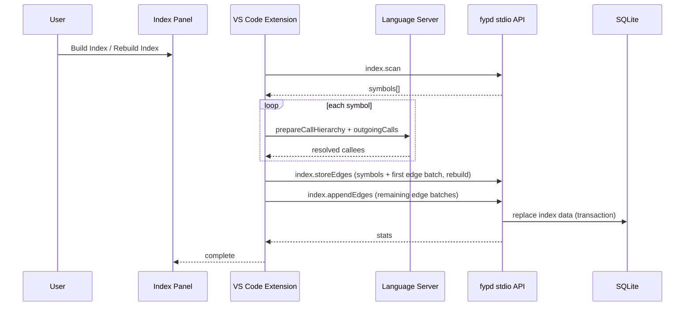

# Indexing Architecture

## Overview

The indexing pipeline is now split into three phases:

1. `index.scan` (Go): tree-sitter scan to collect callable symbols and source positions.
2. LSP resolution (Extension): `vscode.prepareCallHierarchy` + `vscode.provideOutgoingCalls` for each symbol.
3. `index.storeEdges` + `index.appendEdges` (Go): transactional write of symbols and resolved edges into SQLite (batched).

This replaces heuristic AST-only call extraction for workspace indexing.

## Why This Change

The previous heuristic call graph extractor missed or blurred:
- Cross-file type resolution
- Overload signatures
- Interface dispatch
- Generic return dispatch
- Static imports and method references
- `super` target resolution

Using language-server call hierarchy gives compiler-level symbol resolution for supported languages.

## Runtime Flow

## API Contract

### `index.scan`
- Request: `{ rebuild?: boolean }`
- Response: `{ symbols: ScannedSymbol[] }`

`ScannedSymbol`:
- `id`, `name`, `kind`, `filePath`, `uri`, `line` (1-based), `endLine`, `col` (0-based), `signature`, `bodyHash`

### `index.storeEdges`
- Request: `{ symbols: ScannedSymbol[], edges: MethodCall[], rebuild?: boolean }`
- Response: `{ success: boolean, stats: { symbols, edges, durationMs } }`

`MethodCall` payload fields:
- `callerSymbol` (stored as `caller_id`)
- `calleeSymbol` (stored as `callee_id`)
- `callType`, `filePath`, `line`

### `index.appendEdges`
- Request: `{ edges: MethodCall[] }`
- Response: `{ success: boolean, edges: number }`
- Behavior: appends additional edge batches after an initial `index.storeEdges` call.

### `index.scanFile`
- Request: `{ filePath: string }`
- Response: `{ symbols: ScannedSymbol[], changedCallerIds: string[], removedCallerIds: string[], fileHash: string }`

### `index.resolveSymbolsByLocation`
- Request: `{ locations: [{ filePath, line }] }`
- Response: `{ resolved: [{ filePath, line, symbolId? }] }`

### `index.storeFileDelta`
- Request: `{ filePath, fileHash, symbols, changedCallerIds, removedCallerIds, edges }`
- Response: `{ success: boolean, stats: { symbols, edges, durationMs } }`

### `index.clearSymbols`
- Request: `{}`
- Response: `{ success: true }`
- Behavior: clears symbols and call edges.

### `index.run` (deprecated)
- Compatibility stub only. Returns success with `deprecated: true`.
- Does not perform indexing.

## Database Writes

Indexed call edges are stored in `method_calls` with canonical columns:
- `caller_id`
- `callee_id`
- `call_type`
- `file_path`
- `line`

Workspace indexing uses replacement semantics via `ReplaceIndexData(...)` on the initial `index.storeEdges` call, then appends remaining batches via `BulkInsertEdges(...)`.
On-save updates use `ApplyFileDelta(...)` to only replace affected symbols/edges while preserving manual edges.

## Index Panel UX

The Index Panel shows:
- Language server readiness per language plugin.
- Build/Rebuild actions (gated until ready).
- Progress phases (`scan` → `lsp` → `store`).
- Final stats (symbols, edges, duration).

## Current Scope

- Main indexing flow is compiler-resolved via LSP bridge.
- On-save incremental indexing is enabled by default and uses file-scoped delta updates (`index.scanFile` + LSP changed callers + `index.storeFileDelta`).

## Extensibility

Two plug-in points remain:
- Go language plugin registry for scanning symbols by file extension.
- Extension `LanguageLSPPlugin` registry for readiness checks and supported extensions.

Adding a language requires:
1. Go scanner support for symbol discovery.
2. Extension LSP plugin readiness entry.
