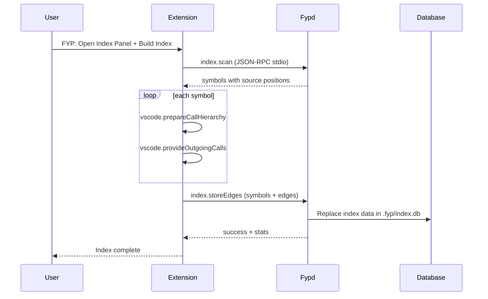
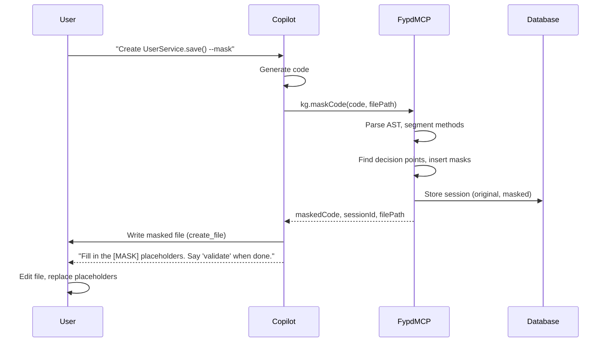
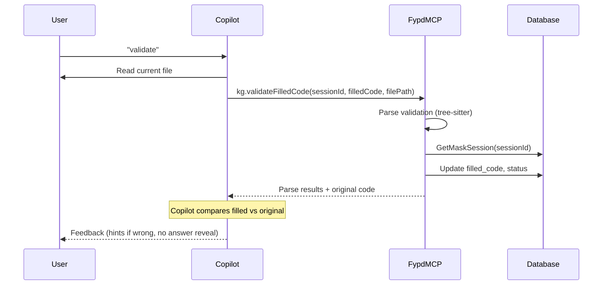
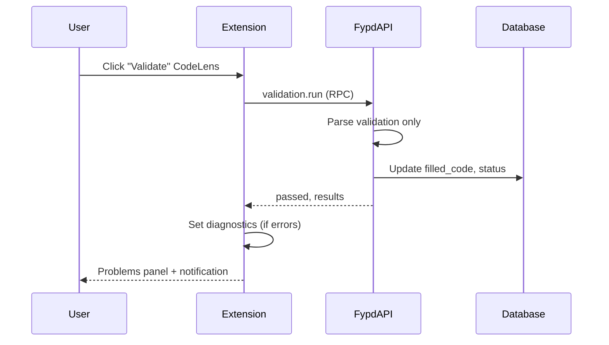
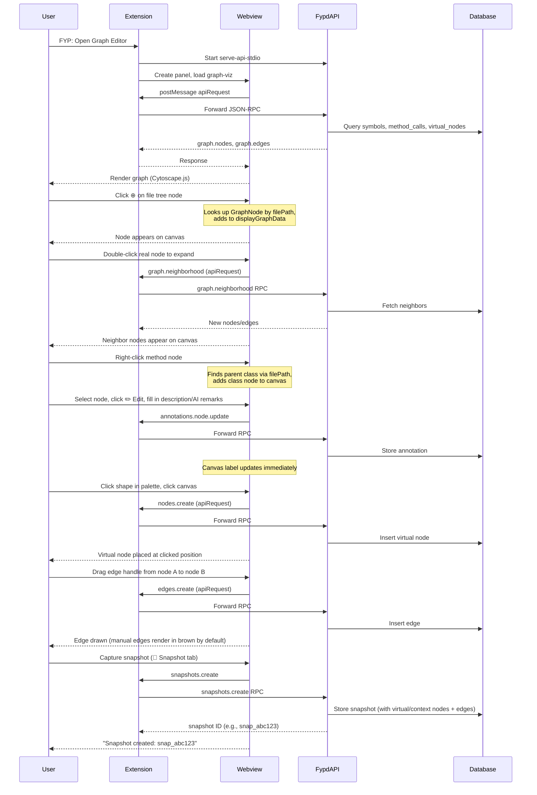

# User Flows: What to Expect

This document describes the end-to-end flows for each of the four core capabilities—indexing, masking, validation, and visualization—from the user's perspective, with sequence diagrams showing the interactions between user, extension, Copilot, and backend.

---

## 1. Indexing

**User goal:** Build a local knowledge base of the codebase (symbols, references, call graph) for visualization and other features.

### What the User Does

1. Open Command Palette (`Ctrl+Shift+P` / `Cmd+Shift+P`) → run **FYP: Open Index Panel**
2. In Index Panel, wait until language server status is ready
3. Click **Build Index** (or **Rebuild Index** for a clean re-index)

### What Happens

- Phase 1 (Go): `index.scan` extracts symbols and positions
- Phase 2 (Extension + LSP): per-symbol call hierarchy resolves outgoing calls
- Phase 3 (Go): `index.storeEdges` writes canonical symbols/edges to `.fyp/index.db`
- Progress appears in the Index Panel (scan → lsp → store)

### Sequence Diagram

---

## 2. Masking

**User goal:** Get AI-generated code with decision points replaced by `[MASK]` placeholders so they can fill in critical logic themselves.

### What the User Does

1. In Copilot chat: include `--mask` in the prompt (e.g., "Create a UserService with CRUD methods --mask")
2. Copilot generates code, masks it, and writes the masked file
3. User fills in the `[MASK]` placeholders in the editor
4. User validates (see Validation flow)

### What Happens

- Copilot sends generated code to `kg.maskCode` (MCP tool)
- Backend parses code, finds decision points (conditionals, returns, etc.), and replaces them with type-aware placeholders and mask markers
- Session is stored in the database; session ID is embedded in mask comments
- Copilot writes the masked code to the file (using the absolute path from the response)
- User edits the file to replace placeholders with real logic

### Sequence Diagram

---

## 3. Validation

**User goal:** Check that their filled code is syntactically valid (and, via Copilot, semantically correct).

Validation can be triggered in two ways:

### Path A: Via Copilot (MCP)

When the user says "validate" or "check my masks":

### Path B: Via CodeLens (Extension)

When the user clicks **Validate All Masks** or **Validate Filled Code** above the file:

**What the user sees:**

- **Parse pass:** "All masks validated successfully"
- **Parse fail:** Errors in the Problems panel with line numbers
- **Via Copilot only:** Semantic feedback (hints vs. correct) based on comparison with original code

---

## 4. Visualization

**User goal:** Explore the call graph, design virtual architecture, annotate nodes/edges, create snapshots for AI context.

### What the User Does

1. Run **FYP: Open Graph Editor** (Command Palette or sidebar)
2. (If needed) Build or Rebuild index first from **FYP: Open Index Panel**
3. **Populate the canvas** — nodes are not shown automatically; add them explicitly:
   - Click **Load All** to pre-load all graph data into memory (still not on canvas)
   - Click **⊕** next to any node in the file tree to add it to the canvas
   - **Double-click** a node on the canvas to expand and add its call-graph neighbors
   - **Right-click** a method → adds its parent class node; right-click a class → adds its parent directory node
4. **Annotate** nodes/edges: single-click a node → InfoPanel opens → click ✏️ Edit → fill in description / AI remarks → Save
5. **Design virtual architecture** using the Shape Palette toolbar above the canvas:
   - Click **⬜ Virtual Directory** → click canvas to place an orange dashed box
   - Click **⬛ Virtual Class** → click canvas to place a purple dashed box
   - Click **◇ Virtual Method** → click canvas to place a purple diamond
   - Escape cancels placement mode
   - Double-click any node (real or virtual) to expand neighborhood
6. **Draw edges** — hover a node until the edge handle appears, then drag to another node
7. **Resize nodes** — select a node, then drag any of the four corner handles
8. **Toggle layers** — use the **Dir / File / Method** buttons in the canvas toolbar to show/hide node groups
9. **Delete nodes/edges** — select then press `Delete` or `Backspace` (virtual nodes are removed from the backend; real nodes are removed from the canvas only)
10. **Clear graph planning state** — use **Clear** to remove all virtual nodes/directories and manual edges from DB state
11. Create snapshots for Copilot (e.g., "Generate the virtual nodes in snapshot snap_abc123")
12. Load a snapshot from **Saved Snapshots → Load** to materialize snapshot state back into the graph

### What Happens

- Extension opens a webview panel and starts the API stdio server if needed
- Webview requests graph data from the backend
- Backend reads from the index database, aggregates symbols and method calls
- User interacts with Cytoscape.js graph; virtual/manual changes are saved to the database
- Loading a snapshot first clears current virtual/manual state, then restores the snapshot's saved virtual nodes/edges

### Sequence Diagram

---

See [COMPONENT_ARCHITECTURE.md](COMPONENT_ARCHITECTURE.md) for how the graph-viz webview, extension, and backend communicate.

## Summary

| Flow | User Trigger | Backend | User Outcome |
|------|--------------|---------|--------------|
| **Indexing** | Open Index Panel → Build/Rebuild | `index.scan` + LSP + `index.storeEdges` | Call graph in `.fyp/index.db` |
| **Masking** | "Create X --mask" (Copilot) | kg.maskCode (MCP) | Masked file with placeholders |
| **Validation** | "validate" (Copilot) or CodeLens | kg.validateFilledCode / validation.run | Parse results, optional semantic feedback |
| **Visualization** | Open Graph Editor | graph.* RPCs, nodes.*, edges.*, annotations.*, snapshots.* | Flat draw.io canvas, virtual node placement, edge drawing, annotations, snapshots |
